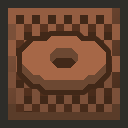

  
# 

# Spare Music
This mod aims to add more music to the game. Bringing more music variety to places that feels repetitive as well as introduce more event-specific music for certain weathers and such.

> The music is created by me, to be used only as part of this mod as distributed.

**This mod uses a modified version of [Glenn's template](https://github.com/GglLfr/MindustryModTemplate)**

## Downloading the mod!
You can download the latest release manually by heading over to the `Releases` and downloading the `.jar` file below. Upload the file in the mod list and reload the game.
You can also download the mod remotely using the github link (`ItsKirby69/Spare-Music`)!

For early releases and versions, you can go to the `Actions` tab at the top to download the zipped Artifact below.