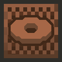

<div align="center">
  
# 

[](https://github.com/ItsKirby69/Spare-Music/releases)
[](https://github.com/ItsKirby69/Spare-Music/releases)
[](https://github.com/ItsKirby69/Spare-Music)
</div>

# Spare Music
Originally made to add more music to the game (still do when I can), Spare Music allows more dynamic music to be added to the game as well as allowing other mods to add their own custom music on certain conditions.
Please scroll down for a guide on how to add custom music with your mod installed alongside this mod.

> The music is created by me, to be used only as part of this mod as distributed.

**This mod uses a modified version of [Glenn's template](https://github.com/GglLfr/MindustryModTemplate)**

## Downloading the mod!
You can download the latest release manually by heading over to the `Releases` and downloading the `.jar` file below. Upload the file in the mod list and reload the game.
You can also download the mod remotely using the github link (`ItsKirby69/Spare-Music`)!

For early releases and versions, you can go to the `Actions` tab at the top to download the zipped Artifact below.

## How to add custom music.
Spare Music Mod allows mods to add music to the music sets available in the base game whilst also adding new sets that plays in certain conditions.
Your options are as follows:
- Ambient Tracks, playing randomly.
- Dark Tracks, plays during certain conditions like low core health.
- Boss Tracks, plays when a boss is present in a wave.
- (custom) Grimdark Tracks, plays during more extreme conditions of Dark tracks.
- (custom) Weather-specific Tracks, plays when certain weather events play.

To start adding music, your mod should have a 'music' folder present.
**JSON/HJSON** mods should have the folder at your root directory.
**JAVA** mods should have the folder under your `assets/` directory.

You may now create a set of directories as shown below (under your project folder) for certain music to play:
```
music/
├── <planet>/
│   ├── ambient/
│   ├── dark/
│   ├── boss/
│   ├── grimdark/
│   └── weathers/
│       ├── <weather>/
│       └── all/
└── global/
    └── same things
```

### Planet specific music
For planet specific tracks, create a folder with your planet's **full internal id**. For example, `minedusty-theia`.
If you'd like music to play **anywhere**, place it under the `global/` folder instead.

### Music sets
As said before, you have different options for when music plays. If you'd like to have ambient music, create an `ambient/` folder under your planet (or the global folder) with your tracks.
> Your options again: `ambient`, `dark`, `boss`, `grimdark`.

### Weather specific music
For weather specific music, create a `weathers/` folder, WITH AN S. Within that folder, create a folder with the weather's **internal id** for your weather-specific tracks to play.
> Your options from vanilla: `snowing`, `rain`, `sandstorm`, `sporestorm`, `fog`, `suspended-particles`, `all` (for any playing weather).

For tracks to be played on **custom** weathers. Create a folder with your weather's **full internal id**. For example, `minedusty-snow-storm`.

### Example structure:
```
<project>/
├── mod.json
└── music/
    ├── minedusty-theia/
    │   ├── ambient/
    │   │   ├── ambient1.ogg
    │   │   └── ambient2.ogg
    │   ├── dark/
    │   │   └── darkness.ogg
    │   ├── grimdark/
    │   │   └── grim1.ogg
    │   └── weathers/
    │       └── rain/
    │           └── its_wet_outside.ogg
    ├── serpulo/
    │   └── ambient/
    │       └── calm_remix.ogg
    └── global/
        ├── boss/
        │   └── doom.ogg
        └── weathers/
            └── minedusty-heavy-rain/
                └── flood.ogg
```

### Limitations
Note that you cannot remove the vanilla music and where they play. You can still use the same music folder to override them however.

The functionality to allow music to appear on several weathers or in different sets is still being worked on. In the future, you will be able to put folders under the `weather/` folder with keywords of weathers. Like `storm/` for any weather with the word "storm" in it's name.

You **CAN** play music on other mods' planets/weathers! Just use their internal ids and it should work.

### Mods that tamper with the game's music may mess with this mod's ability to play custom music!!
